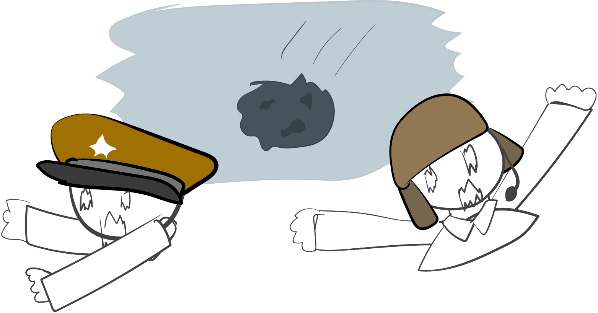
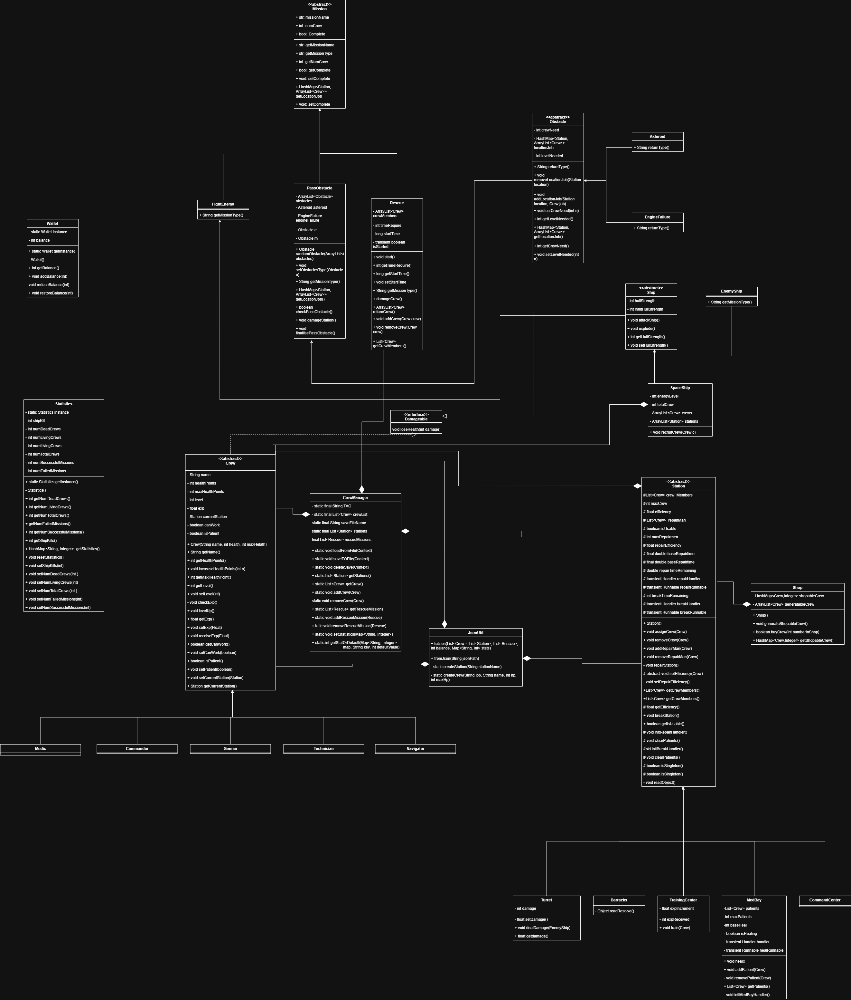

# SPACE COLONIZATION
We are the 3 idiotic students who are studying in Lappeenranta right now. We see project, we do it with a lot of back pain but also with tears of joy.

*in-game image*

## **WORK DISTRIBUTION**
### Thuan

- Designing all the UI models and components
- New JsonUtil file save and load system
- Activity, Fragment and Adapter
- All the ship classes
- Original FriendlyShip
- Initialize the github repo
- Organizing the project plan and documentation
- Add more setter and getter for Station and Crew
- Constantly drag the members into voice chat so they don't slack off
- Doing front-end but has to constantly fix the back-end code
- "WHY DID THE BARRACKS WIPE / DUPLICATE ALL THE CREW MEMBERS. FIX YOUR DAMN CODE"

### Umesh
- All the Station classes
- Old CrewManager (new crewmanager still has functions from this and it was built not to have conflicts with previous crewmanager usages in main game logic)
- Statistics
- Wallet
- Some changes to Crew (to get them to work better with Stations and file saving)
- Some changes to RescueMission (to get them to work better with Stations and crew)
- Helping other members, make proper use of stations
- Small parts in main game logic, other missions and ship
- Babysitiing the other members, BECAUSE THEY DONT READ THE DAMN REQUIREMENTS!!!!

### Atiwit
- Original Crew
- Shop
- Name generator
- Mission
- Path generator
- Different mission logic inside their Activity (fightenemyactivity, rescueactivity, asteroidactivity, enginefailoractivity)
- Modify Map activity (use generate path, and navigator skill)
- Be an adversary force that drive project out of bound
(the original overboard idea)
- The slack off of the team

## **CORE CONCEPT**

The player is put on a ship and their job is to manage it.
The ship is continuously flying and engaging in missions until the ship explodes.
In the main menu, there is a load game option, but in reality it is only one game, meaning the saved files are just the same game but at a certain checkpoint.
If the ship explodes or all crew are down, the game is over and all the data is wiped. Players can still load previous checkpoints.
The game is turn-based, meaning if the player performs an action, the next turn will be only the threat’s turn to move. Transferring crews between stations will not count as performing an action.

### **IMPORTANT: the game has to be in landscape mode, especially if you are testing on emulator. Even though it will be automatically rotated, some devices may refuse to rotate**

## **VIDEO DEMONSTRATION**
[A demonstration video. Definitely not a rick roll link](https://www.youtube.com/watch?v=X25ZJ84NOMo&t=1032s)
- 0:05 - Station, Crew, Statistics, Old Crew Manager
- 16:29 - Shop and Wallet
- 19:04 - Mission
- 24:53 - JSON Utility
- 30:55 - Activities, Adapter, Fragment, .xml files
- 55:04 - Game demonstration

## **UML DIAGRAM**

## **ACTIVITIES**
For every screen you see in the game is an Activity class. It mainly consist of initialization of View objects, and connect the button with the back end logic using the on click listener. Also implement core logic if the Activity is activated (for example enemy attack friendly in FightEnemyActivity)

## **ADAPTER**
Created for every available **recycler view available** in the xml file. This is to auto repeat the card (for example crew card) without to hardcode every single available data.

## **FRAGMENTS**
Created if a UI component is being **reused**. Most reasonable use of fragment in this game is the ship fragment, as it's a big fragment that contains a huge amount of functions and is reused in FightEnemyActivity and MapActivity.

## **OLD CREWMANAGER EXPLANATION**

The original implementation of CrewManager.java made use of serialization instead of json. But it has a few ghost object bugs that we could not fix. With some combinations of clicking continue and new game, some ghost crew exist from previous assignments and sometimes the view adapters break and don't show anything in stations even though crew are there. The old version is also included in project files as a text file in the station folder.

## **MISSION**

mission superclass contain difference type of mission as of fight enemy, rescue, and obstacle. the main core component of each mission as the timer and the array list of crew will be in each separate module as each mission require difference component, however the mission super class contain the normal share parameter and their getter. 
The  main function on these mission are setcomplete() which update the statistic of the game which will intertwine directly with the difficulty of the game

## **SHOP**

Shop module is an object that link with wallet, it randomly generate 3 crew with difference condition (health, maxhealth) and output them in a HashMap which contain crew and their corresponded price. and further it contain buy function which will automatically check for the amount of money from the wallet and act accordingly. it also contain normal getter function to access the crew generated.

## **WALLET**

wallet is a singleton that contain the amount of money the player have. When created the player will have base 100 coin and complete the mission the money will be give difference by mission type. the function contain inside the wallet single ton are simple getter and increase and lose money function

## **STATIONS**

One parent class, 'Station', handles most of the functions of different stations. Child classes have their own implementations for efficiency and also methods for station specific roles like damage related methods in Turret, healing related methods in medbay and training related functions in TrainingCenter. 
Stations have an attribute 'isUsable' which is used in crew assignment and halting stations' functions if the station is broken and to open up spots for repairmen.

## **CREW**

Crew superclass contains getters and setters for all of its attributes. All functions of Crew are handled by the parent class. Child classed do not have their own methods. Missions and Stations check for the specific subclass of crew when handing out bonusses.
the most notable attributes are currentStation and canWork. 
currentStation - useful for avoiding duplicate assignments and in file saving.
canWork - useful when assigning tasks

## **STATISTICS**

Keeps track of various things like number of living crew and number of successful missions. It is a singleton class for ease of use across the project. Contains getters and setters for all tracked statistics and some supporting functions for file saving.

## **BONUS POINTS**

- Multiple RecyclerView (each Adapter in the code is a recycler view)
- Crew Images
- Mission Visualization
- Statistics
- No Death: any damaged crew (either from fight enemy or rescue mission) can be healed in medbay. But if a station breaks and is not repaired in time, they die.
- Randomness in missions
- Specialization Bonuses: Medbay and Turret efficiency can be further improved by assigning Medic and Gunner respectively. Technician also fix station faster if assigned.
- Larger Squads: can be seen in Turret and Rescue Mission. Maximum crew is increased from 2 to 3 if we have 3 or more enemy ship kills
- Used a lot of fragments
- Data Storage & Loading
- Statistics Visualization: text based
- Custom feature: multiple station that function different things and the map jump system

## **AI USAGE**
### Umesh
Android studio integrated Gemini was used for understanding proper implementation of Runnables and Handlers for Station functions. Also used for solving deserializing singleton class (reaResolve function at the end of Barracks.java).

NOTE: Serialization related functions are not used in the final version of our project but they still remain in place as proof

### Thuan
AI was used to assist with the new Json save and load system, adapter and fragments, with the latter 2 are new concept and needed AI to understand how to use it quickly.

### Atiwit
AI was used in scheduling parts
